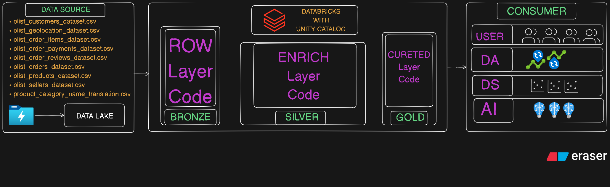
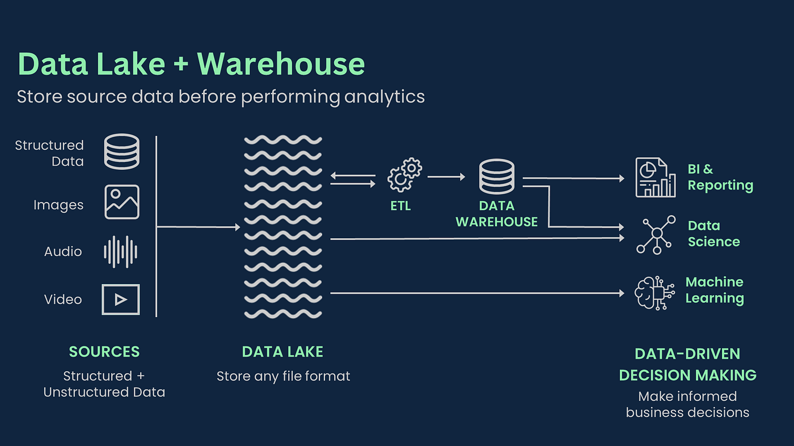
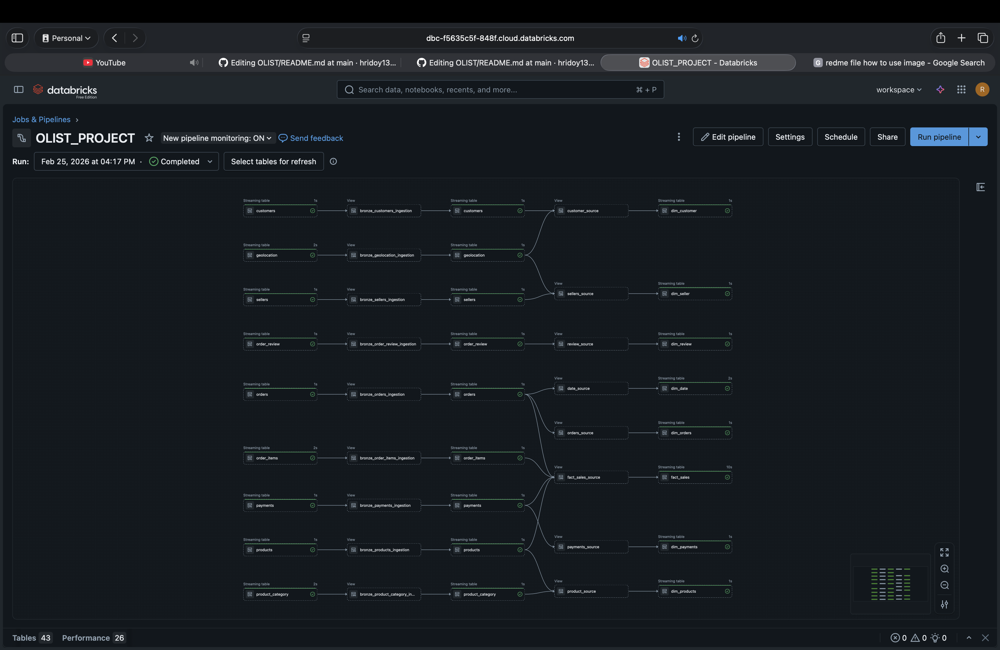

# Olist Payments Pipeline - Delta Live Tables Project

## Project Overview

The **Olist Payments Pipeline** is designed to ingest, transform, and validate payment data from the raw bronze layer to the silver layer using **Databricks Delta Live Tables (DLT)**.

This project ensures:

* Reliable **streaming ingestion** from raw data sources.
* **Schema consistency** between bronze and silver layers.
* **Data quality enforcement** for key fields.
* **Slowly Changing Dimension** *[Type-1, Type-2]*
* Support for downstream analytics and reporting.

---

## Architecture
**PROJECT ARCHITECTURE**

## Diagram
```
Landing Layer (All Data Available)
   |
   |--[Row data Conming on data lake]
   |
Bronze Layer (raw ingestion from data lake)
   |
   |--[DLT Streaming Pipeline]
   |
Silver Layer (cleaned, validated, structured)
   |
   |--[Machine Learning, Artificial Intelligence, Data Scientist]
   |
Gold Layer (Business Ready Data, Star Schema Modeling)
   |
   |--[Analytical Queries, BI Tools]
   |
```

* **Bronze Layer**: Contains raw `payments` data with minimal validation.
* **Silver Layer**: Cleaned, schema-corrected, and validated `payments` table ready model building.
* **Gold Layer**  : Business Ready Star Schema Model for analysis `payments` table ready for analysis.
---

## Pipeline Details
**LAKE HOUSE ARCHITECTURE**


### Bronze Table Ingestion

* Source: `olist_cata.bronze.payments`
* Reads as a **streaming table**.
* Filters out records where `order_id` is null.

## Data Quality Rules

| Rule Name                       | Description                             |
| ------------------------------- | --------------------------------------- |
| `order_id_not_null`             | `order_id` must not be null             |
| `payment_sequential_not_null`   | `payment_sequential` must not be null   |
| `payment_type_not_null`         | `payment_type` must not be null         |
| `payment_installments_not_null` | `payment_installments` must not be null |
| `payment_value_positive`        | `payment_value` must be > 0             |

## Data Schema

**Silver Table: `olist_cata.bronze.payments`**
# BEFORE

| Column Name          | Data Type | Nullable |
| -------------------- | --------- | -------- |
| order_id             | STRING    | YES      |
| payment_sequential   | STRING    | YES      |
| payment_type         | STRING    | YES      |
| payment_installments | STRING    | YES      |
| payment_value        | STRING    | YES      |

# AFTER

| Column Name          | Data Type | Nullable |
| -------------------- | --------- | -------- |
| order_id             | STRING    | YES      |
| payment_sequential   | STRING    | YES      |
| payment_type         | STRING    | YES      |
| payment_installments | STRING    | YES      |
| payment_value        | STRING    | YES      |
| ingest_at            | TIMESTAMP | NO       |

**add one column for Slowly Changing Dimension (ingest_at)**
---

### Silver Table Transformation

* Target: `olist_cata.silver.payments`
* **Column casting** ensures compatibility with the declared schema:

  * `order_id` → STRING
  * `payment_sequential` → INT
  * `payment_type` → STRING
  * `payment_installments` → INT
  * `payment_value` → DOUBLE
  * `ingest_at` → TIMESTAMP
* Filters nulls for **NOT NULL fields**.

---

## Data Schema

**Silver Table: `olist_cata.silver.payments`**

| Column Name          | Data Type | Nullable |
| -------------------- | --------- | -------- |
| order_id             | STRING    | NO       |
| payment_sequential   | INT       | NO       |
| payment_type         | STRING    | NO       |
| payment_installments | INT       | NO       |
| payment_value        | DOUBLE    | NO       |
| ingest_at            | TIMESTAMP | NO       |

---

## GOLD LAYER
**Building Data Model with ( Star Schema)**
```
           Dim_Date
              |
Dim_Product — Fact_Sales — Dim_Customer
              |
           Dim_Store
```

## Data Folw Look Like This:

These rules are enforced using **DLT expectations**. Records failing these rules are dropped automatically.

---

## Getting Started

### Prerequisites

* Databricks workspace with **DLT enabled**
* Delta tables for **bronze layer** already available (`olist_cata.bronze.payments`)
* Python 3.9+ runtime

### Installation

1. Clone the repository:

```bash
git clone https://github.com/your-org/olist-payments-dlt.git
cd olist-payments-dlt
```

2. Upload the `.py` DLT script to Databricks or your pipeline repo.

3. Configure your **DLT pipeline**:

   * Source: `python file` from repo
   * Target schema: `olist_cata.silver.payments`
   * Enable **streaming** mode

---

## Deployment

1. **Create a new Delta Live Tables pipeline** in Databricks.
2. Attach the pipeline to a **cluster with sufficient compute**.
3. Configure:

   * Storage location (DBFS or external Delta Lake)
   * Full refresh or incremental mode
4. Start the pipeline; DLT will automatically process streaming bronze data into silver.

---

## Maintenance & Monitoring

* Monitor **pipeline health** in the Databricks DLT UI.
* Check **data quality metrics** and failed records.
* Use **Delta table versioning** for debugging and rollback.
* Schedule **daily or hourly refresh** depending on business requirements.

---

## Contributing

1. Fork the repository.
2. Create a feature branch: `git checkout -b feature/your-feature`.
3. Commit your changes with descriptive messages.
4. Submit a pull request for review.

---

## License

This project is licensed under the **MIT License** – see the LICENSE file for details.

---

I can also create a **version with badges, CI/CD info, and visuals** for a fully professional README like you’d see in production projects.

Do you want me to make that enhanced version?
